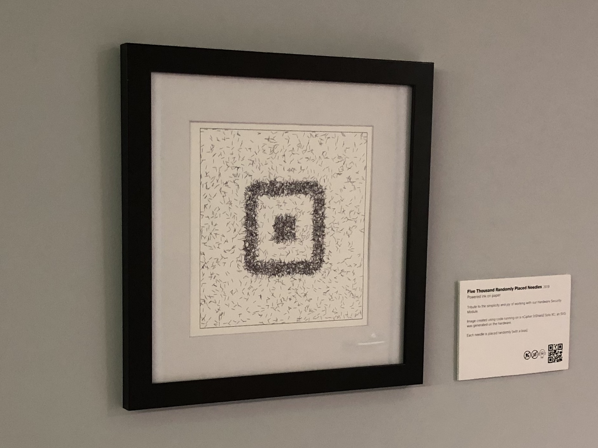

# 5000 Randomly Placed Needles
A crypto(graphy) related piece of art.

> Tribute to the simplicity and joy of working with our Hardware Security Module.
>
> Image created using code running on a nCipher (nShield) Solo XC; an SVG was generated on the hardware.
>
> Each needle is placed randomly (with a bias).
